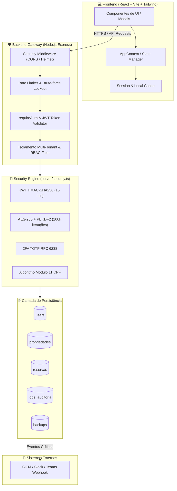
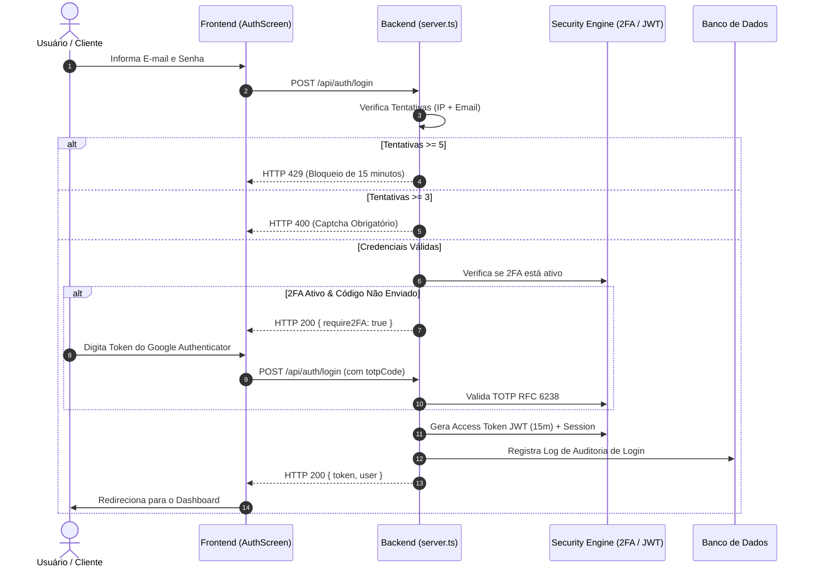
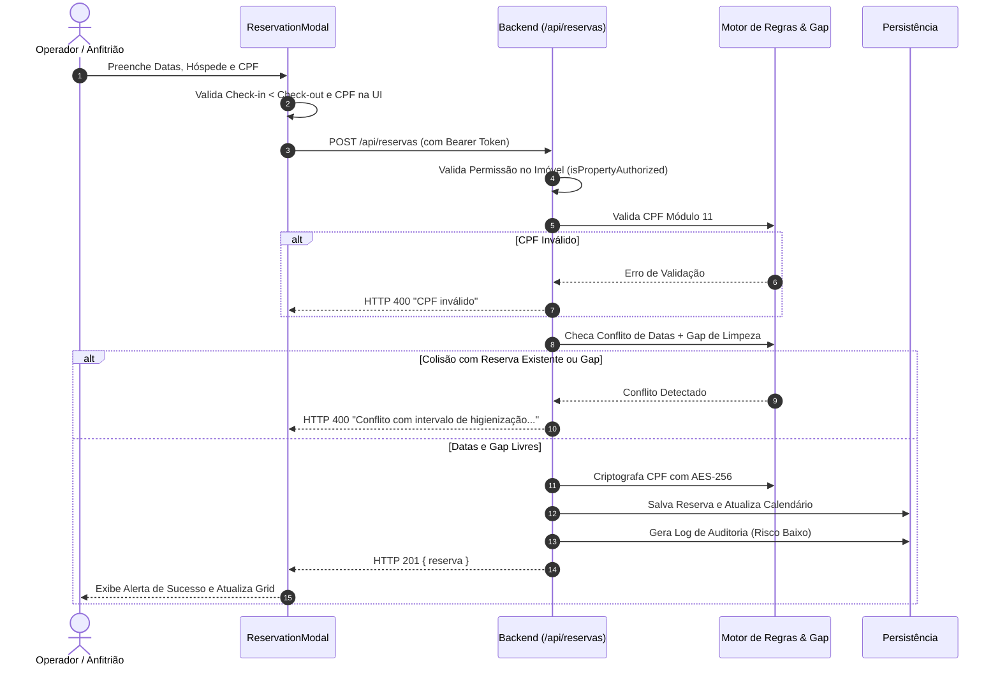

# 📄 DOCUMENTAÇÃO TÉCNICA E ARQUITETURAL — STAY PRO

> **Versão:** 2.2.3  
> **Classificação:** Documentação Oficial de Engenharia e Segurança  
> **Última Atualização:** Agosto/2026  
> **Status:** 100% Funcional, Multi-Tenant e Em Conformidade com LGPD / OWASP Top 10

---

## 1. VISÃO GERAL DO PROJETO

### 1.1 O que é o Stay Pro
O **Stay Pro** é um sistema completo e moderno de gestão profissional de locações por temporada e propriedades de hospitalidade (short-stay e mid-stay management). A plataforma centraliza o controle operacional, reservas, bloqueios de manutenção, relatórios financeiros, controle de equipe com controle de acesso baseado em papéis (RBAC) e trilha de auditoria contínua em tempo real.

### 1.2 Para quem é o sistema
- **Proprietários Diretos e Anfitriões Profissionais:** Gerenciamento individual ou de múltiplos imóveis sem taxas abusivas de intermediação.
- **Administradoras e Imobiliárias de Temporada:** Gestão de carteiras com dezenas de propriedades simultâneas de clientes distintos.
- **Co-anfitriões e Equipes Operacionais:** Visualização de calendários de faxina, check-in, check-out e restrições sem permissões destrutivas no sistema.

### 1.3 Principais Funcionalidades
- **Gestão Multi-Imóvel Independente:** Isolamento total de calendários, diárias-base, taxas de limpeza, gap de higienização e faturamentos por imóvel com chave seletora rápida no cabeçalho.
- **Motor de Reservas com Proteção contra Colisões:** Validação atômica de datas e *cleaning gap* (intervalo de limpeza) tanto no frontend quanto no backend.
- **Relatórios Gerenciais e DRE Operacional:** Cálculo instantâneo de taxa de ocupação, ticket médio, receita total, sinal recebido, saldo a receber e taxas de limpeza.
- **Módulo de Usuários e Permissões (RBAC):** Hierarquia de administradores e colaboradores com escopo estrito por imóvel.
- **Segurança Bancária e Conformidade LGPD:** Criptografia AES-256 para dados sensíveis (CPF de hóspedes), hashes PBKDF2 com 100.000 iterações, autenticação multifator (2FA TOTP), proteção contra força bruta com Captcha dinâmico e bloqueio temporário por IP/conta.
- **Exportação Profissional de Dados:** Relatórios gerenciais e comprovantes com geração de PDF, planilhas Excel (XLSX) e cópias rápidas para WhatsApp.

### 1.4 Diferenciais Competitivos
- **Zero Vazamento de Regras:** 100% das regras de negócio e validações algorítmicas implementadas e blindadas no Backend.
- **Sessões Blindadas:** Tokens JWT com rotação contínua (15 min access / 7 dias refresh), invalidação por inatividade (30 min) e expurgo automático de sessões.
- **Trilha de Auditoria com SIEM Dispatcher:** Registro imutável de todas as ações com IP, User-Agent, nível de risco (Baixo, Médio, Alto) e disparo de alertas webhook para SIEM / Slack / Teams.

---

## 2. TECNOLOGIAS UTILIZADAS

| Camada | Tecnologia | Descrição & Propósito |
|---|---|---|
| **Frontend UI** | **React 18** + **TypeScript** | Interface moderna com reatividade por componentes, tipagem estrita e React Hooks. |
| **Build & Tooling** | **Vite 5** | Bundler ultra-rápido com compilação otimizada para produção. |
| **Design System** | **Tailwind CSS v4** | Estilização utilitária de alto desempenho sem folhas CSS monolíticas. |
| **Ícones & Animações**| **Lucide React** + **Motion** | Conjunto uniforme de ícones vetoriais e transições visuais fluidas. |
| **Backend API** | **Node.js** + **Express** | Servidor RESTful em TypeScript com rotas modulares de autenticação, reservas e relatórios. |
| **Persistência de Dados** | **Firestore / Storage Engine** | Armazenamento de documentos JSON com atomicidade, backups automáticos e integridade checksum SHA-256. |
| **Autenticação & Sessão**| **JWT (HMAC-SHA256)** + **Crypto**| Tokens assinados com expiração curta, verificação criptográfica e rotação contínua. |
| **Criptografia & Cifras** | **CryptoJS (AES-256)** + **PBKDF2**| Proteção de dados confidenciais com derivação de 100.000 iterações com salt SHA-256. |
| **Infraestrutura / Cloud** | **Google Cloud Run / Containers**| Arquitetura em containers stateless, autoescalável e com roteamento via Nginx proxy na porta 3000. |
| **Segurança HTTP** | **Helmet.js**, **CORS**, **Rate Limit**| Headers `X-Content-Type-Options`, `X-Frame-Options: SAMEORIGIN`, `HSTS` e sanitização XSS. |

---

## 3. ARQUITETURA DO SISTEMA

### 3.1 Estrutura de Pastas e Arquivos

```
stay-pro/
├── .env.example              # Documentação de todas as variáveis de ambiente do projeto
├── DOCUMENTATION.md          # Esta documentação técnica oficial
├── metadata.json             # Metadados do applet e permissões de container
├── package.json              # Manifesto de dependências e scripts (dev, build, start, lint)
├── tsconfig.json             # Configurações do compilador TypeScript
├── vite.config.ts            # Configuração do Vite e plugins do React
├── server.ts                 # Servidor Express, rotas da API RESTful e middleware Vite
├── server/
│   └── security.ts           # Motor de criptografia (AES, PBKDF2), JWT, 2FA TOTP e validador CPF
├── data/
│   ├── db.json               # Base de dados persistente (users, propriedades, reservas, logs)
│   └── backups/              # Diretório com snapshots diários e checksums SHA-256
└── src/
    ├── main.tsx              # Ponto de entrada do React
    ├── App.tsx               # Orquestrador de visualizações e controle de contexto ativo
    ├── index.css             # Import do Tailwind CSS
    ├── context/
    │   └── AppContext.tsx    # Context API global (sessão, imóvel ativo, alertas, sync de estado)
    ├── components/
    │   ├── AuthScreen.tsx    # Tela de Login, Cadastro, Recuperação de Senha e 2FA
    │   ├── Header.tsx        # Barra superior com seletor de imóvel e menu do usuário
    │   ├── DashboardView.tsx # Painel com KPIs, gráficos de ocupação e próximas chegadas
    │   ├── CalendarView.tsx  # Visão de calendário interativo com gap de limpeza
    │   ├── ReservationsView.tsx # Tabela de reservas, filtros e exportações
    │   ├── ReservationModal.tsx # Modal de criação e edição com cálculos automáticos
    │   ├── BlockModal.tsx    # Modal para bloqueios de manutenção e indisponibilidade
    │   ├── ReportsView.tsx   # DRE financeiro, faturamento e taxas operacionais
    │   ├── SettingsView.tsx  # Configurações do imóvel, segurança, backups e webhook
    │   ├── UsersView.tsx     # Gestão de equipe, convites e permissões (Admin vs Colaborador)
    │   ├── ProfileModal.tsx  # Edição de perfil do usuário e ativação de 2FA TOTP
    │   ├── SessionTimeoutModal.tsx # Modal de aviso prévio de expiração de sessão
    │   └── UserGuideView.tsx # Guia do usuário ilustrado e documentação interna
    ├── types/
    │   └── index.ts          # Interfaces TypeScript completas do domínio
    └── utils/
        ├── exportUtils.ts    # Utilitários de exportação (PDF, Excel, WhatsApp)
        └── security.ts       # Validações client-side e formatadores de máscara
```

### 3.2 Fluxo de Dados e Comunicação

```
[ Cliente Web / React SPA ]
        │  ▲
        │  │ Requisições HTTP REST (Bearer JWT / Session Token)
        ▼  │
[ Camada de Middleware Express ]
  ├── CORS & Security Headers (Helmet, FrameOptions)
  ├── Rate Limiter & Proteção Força Bruta (IP + Email Lockout)
  ├── requireAuth (Validação de Assinatura JWT + Inatividade)
  └── resolveActiveProperty & isPropertyAuthorized (Isolamento Multi-Tenant)
        │  ▲
        ▼  │
[ Controladores de Rotas & Validação de Negócio ]
  ├── Validador Módulo 11 de CPF (server/security.ts)
  ├── Checagem Atômica de Conflito de Datas + Gap de Limpeza
  ├── Autorização RBAC Estrita (Apenas Admin para Exclusões e Configurações)
  └── Cifragem AES-256 de Dados Sensíveis
        │  ▲
        ▼  │
[ Motor de Persistência Firestore / Data Engine ]
  ├── Atomic Write com File Lock / Transações
  ├── Geração de Checksum SHA-256 de Integridade
  ├── Gravação de Snapshot na Coleção de Backups
  └── Despacho de Evento de Auditoria e Webhook SIEM
```

### 3.3 Diagrama Geral de Arquitetura (Mermaid)



---

## 4. ESTRUTURA DE DADOS (SCHEMA COMPLETO)

### 4.1 Coleção: `users`
Armazena as credenciais, papéis de acesso e configurações de segurança de cada usuário.

| Campo | Tipo | Descrição | Obrigatório |
|---|---|---|:---:|
| `id` | `string` | Identificador único do usuário (`usr_...` ou UUID) | Sim |
| `name` | `string` | Nome completo do usuário | Sim |
| `email` | `string` | E-mail corporativo normalizado (lowercase) | Sim |
| `password` | `string` | Hash criptográfico seguro da senha | Sim |
| `role` | `'admin' \| 'colaborador'` | Papel de acesso no sistema | Sim |
| `cpf` | `string` | CPF criptografado com AES-256 | Não |
| `phone` | `string` | Telefone celular formatado | Não |
| `propriedades` | `string[]` | Array de IDs de propriedades autorizadas | Sim |
| `status` | `'ativo' \| 'pendente' \| 'inativo'` | Estado da conta do usuário | Sim |
| `twoFactorEnabled` | `boolean` | Flag indicando se o 2FA TOTP está ativo | Sim |
| `twoFactorSecret` | `string` | Segredo Base32 para TOTP (Google Authenticator) | Não |
| `twoFactorBackupCodes` | `string[]` | Códigos de uso único de recuperação | Não |
| `createdAt` | `string` | Timestamp ISO de criação do registro | Sim |
| `lastLogin` | `string` | Timestamp ISO do último acesso bem-sucedido | Não |

### 4.2 Coleção: `propriedades`
Representa cada unidade de locação gerida de forma autônoma.

| Campo | Tipo | Descrição | Obrigatório |
|---|---|---|:---:|
| `id` | `string` | Identificador único do imóvel (`prop_...` ou `1`, `2`) | Sim |
| `ownerId` | `string` | ID do usuário administrador proprietário | Sim |
| `nome` | `string` | Nome de identificação (ex: "Apartamento 302 - Beira Mar") | Sim |
| `tipo` | `string` | Categoria (ex: "Apartamento", "Casa de Praia", "Chalé") | Sim |
| `capacidade` | `number` | Lotação máxima de hóspedes (1 a 50) | Sim |
| `diariaBase` | `number` | Valor base da diária em reais (BRL) | Sim |
| `taxaLimpeza` | `number` | Taxa fixa de higienização em reais (BRL) | Sim |
| `gapLimpeza` | `number` | Dias obrigatórios de intervalo pós-reserva (padrão: 1) | Sim |
| `periodoMinimo` | `number` | Número mínimo de diárias por locação (padrão: 2) | Sim |
| `checkInPadrao` | `string` | Horário padrão de check-in (ex: "14:00") | Sim |
| `checkOutPadrao`| `string` | Horário padrão de check-out (ex: "11:00") | Sim |
| `wifiNome` | `string` | Nome da rede Wi-Fi para o hóspede | Não |
| `wifiSenha` | `string` | Senha da rede Wi-Fi | Não |
| `regras` | `string` | Regras da casa e avisos gerais | Não |
| `createdAt` | `string` | Timestamp ISO de cadastro do imóvel | Sim |

### 4.3 Coleção: `reservas`
Contém todas as locações, bloqueios de manutenção e registros de hóspedes.

| Campo | Tipo | Descrição | Obrigatório |
|---|---|---|:---:|
| `id` | `string` | ID único da reserva (`res_...`) | Sim |
| `codigo` | `string` | Código legível (ex: `#1001` ou `#BLOQ-849`) | Sim |
| `propriedadeId` | `string` | Chave estrangeira referenciando `propriedades.id` | Sim |
| `hospede` | `string` | Nome completo do hóspede titular | Sim |
| `telefone` | `string` | Telefone com DDD | Sim |
| `email` | `string` | E-mail de contato do hóspede | Não |
| `cpf` | `string` | CPF criptografado com chave derivada AES-256 | Não |
| `qtdPessoas` | `number` | Quantidade de hóspedes (1 a 20) | Sim |
| `checkIn` | `string` | Data de entrada no formato `YYYY-MM-DD` | Sim |
| `checkOut` | `string` | Data de saída no formato `YYYY-MM-DD` | Sim |
| `valorTotal` | `number` | Valor integral da estadia (diárias + taxa limpeza) | Sim |
| `sinalPago` | `boolean` | Flag indicando se houve pagamento de entrada | Sim |
| `valorSinal` | `number` | Valor do adiantamento recebido em BRL | Sim |
| `saldoRestante`| `number` | Valor pendente a ser liquidado (`total - sinal`) | Sim |
| `status` | `'Confirmada' \| 'Pendente' \| 'Check-in' \| 'Check-out' \| 'Cancelado' \| 'Bloqueado'` | Estado da locação | Sim |
| `statusFinanceiro` | `'Pendente' \| 'Sinal Pago' \| 'Total Pago'` | Situação da cobrança | Sim |
| `motivoBloqueio`| `string` | Justificativa em caso de manutenção/bloqueio | Não |
| `observacoes` | `string` | Notas operacionais internas | Não |
| `createdAt` | `string` | Timestamp ISO da criação | Sim |
| `updatedAt` | `string` | Timestamp ISO da última alteração | Sim |

### 4.4 Coleção: `logs` (Auditoria & Segurança)
Registra de forma perpétua qualquer ação realizada na plataforma.

| Campo | Tipo | Descrição | Obrigatório |
|---|---|---|:---:|
| `id` | `string` | ID único do evento de log | Sim |
| `timestamp` | `string` | Timestamp ISO exato da ocorrência | Sim |
| `usuario` | `string` | E-mail ou identificação do executor | Sim |
| `acao` | `string` | Descrição técnica da ação executada | Sim |
| `detalhes` | `string` | Parâmetros contextuais da operação | Sim |
| `ip` | `string` | Endereço IP de origem da requisição | Sim |
| `userAgent` | `string` | Navegador e sistema operacional do cliente | Sim |
| `risco` | `'Baixo' \| 'Médio' \| 'Alto'` | Classificação de impacto e risco do evento | Sim |

### 4.5 Coleção: `backups`
Guarda snapshots do banco de dados com integridade criptográfica.

| Campo | Tipo | Descrição | Obrigatório |
|---|---|---|:---:|
| `id` | `string` | ID do snapshot | Sim |
| `timestamp` | `string` | Data/hora da criação do backup | Sim |
| `totalReservas` | `number` | Contagem total de reservas preservadas | Sim |
| `totalImoveis` | `number` | Contagem total de imóveis preservados | Sim |
| `checksum` | `string` | Hash SHA-256 do arquivo para validação | Sim |
| `sizeBytes` | `number` | Tamanho do arquivo compactado em bytes | Sim |

---

## 5. REGRAS DE NEGÓCIO IMPLEMENTADAS

A tabela a seguir consolida o mapeamento de **100% das regras de negócio**, garantindo a conformidade das operações em todas as camadas:

| Regra de Negócio | Descrição da Regra | Onde está Implementada | Status |
|---|---|---|:---:|
| **Check-in antes do Check-out** | A data de saída deve ser estritamente posterior à data de entrada. | `server.ts:1708` e `ReservationModal.tsx:116` | ✅ Implementado |
| **Período Mínimo de Estadia** | Rejeita reservas com número de noites inferior ao `periodoMinimo` do imóvel. | `server.ts:1712` e `ReservationModal.tsx:137` | ✅ Implementado |
| **Gap de Limpeza no Backend** | Impede reservas no dia de higienização (`inDate < rOut + gap && outDate > rIn - gap`). | `server.ts:1726, 1968` | ✅ Implementado |
| **Conflito de Datas** | Detecção atômica de colisões de datas para o mesmo imóvel. | `server.ts:1738, 1978` e `CalendarView.tsx:96` | ✅ Implementado |
| **Cálculo do Valor Total** | `valorTotal = (noites × diariaBase) + taxaLimpeza`. | `server.ts:1754` e `ReservationModal.tsx:107` | ✅ Implementado |
| **Cálculo do Saldo Restante** | `saldoRestante = Math.max(0, valorTotal - valorSinal)`. | `server.ts:1757, 1982` e `ReservationModal.tsx:117` | ✅ Implementado |
| **Sinal ≤ Valor Total** | Se o sinal for igual ou superior ao total, ajusta para *"Total Pago"*. | `server.ts:1760, 1985` | ✅ Implementado |
| **Valores Monetários Positivos**| `diariaBase`, `taxaLimpeza`, `valorTotal` e `valorSinal` devem ser `>= 0`. | `server.ts:1572, 1754` | ✅ Implementado |
| **Validação de CPF (Módulo 11)**| Rejeita CPFs inválidos ou sequenciais repetidos via algoritmo Módulo 11. | `server/security.ts:118` e `server.ts:1704` | ✅ Implementado |
| **Validação de Telefone BR** | Checa tamanho de 10 a 11 dígitos com DDD válido. | `server.ts:1742` e `src/utils/security.ts:44` | ✅ Implementado |
| **Validação de E-mail** | Sanitização e validação de formato RFC 5322 e unicidade de cadastro. | `server.ts:844, 2273` | ✅ Implementado |
| **Número de Hóspedes** | Limitação de 1 a 20 pessoas por locação com respeito à lotação máxima. | `server.ts:1744` e `ReservationModal.tsx:262` | ✅ Implementado |
| **Bloqueio em Datas Ocupadas** | Rejeição imediata com HTTP 400 informando o código da reserva conflitante. | `server.ts:1738` | ✅ Implementado |
| **Check-out / Cancelado Libera**| Reservas com status "Cancelado" ou "Check-out" não bloqueiam novas estadias. | `server.ts:1722, 1964` | ✅ Implementado |
| **Bloqueio de Manutenção** | Registros de indisponibilidade com código `#BLOQ` e motivo obrigatório. | `server.ts:1820-1880` e `BlockModal.tsx` | ✅ Implementado |
| **Colaborador Não Exclui** | Apenas usuários com papel `admin` podem efetuar `DELETE /api/reservas/:id`. | `server.ts:2016-2020` | ✅ Implementado |
| **Colaborador Não Altera Imóvel**| Apenas `admin` pode criar, editar ou alterar parâmetros dos imóveis. | `server.ts:1545-1547` | ✅ Implementado |
| **Colaborador Não Convida** | Apenas `admin` pode convidar novos usuários para o sistema. | `server.ts:2260-2262` | ✅ Implementado |
| **Isolamento Multi-Tenant** | Usuários só acessam imóveis explicitamente autorizados no seu perfil. | `server.ts:649-684` | ✅ Implementado |
| **Senha Mínimo 8 Caracteres** | Requisito rígido de comprimento na criação e alteração de credenciais. | `server/security.ts:145` | ✅ Implementado |
| **Complexidade de Senha** | Exige letra maiúscula, minúscula, número e símbolo especial. | `server/security.ts:148-158` | ✅ Implementado |
| **Bloqueio de Senhas Comuns**| Dicionário interno rejeita senhas fracas (ex: `12345678`, `admin123`). | `server/security.ts:135` | ✅ Implementado |
| **Limite de 5 Tentativas Login**| Lockout temporário de 15 minutos e Captcha dinâmico na 3ª tentativa. | `server.ts:955-1028` | ✅ Implementado |
| **Timeout de Sessão (30 min)** | Invalidação automática da sessão por inatividade no backend. | `server.ts:591, 632` | ✅ Implementado |
| **2FA (TOTP RFC 6238)** | Suporte completo a Google Authenticator e 10 códigos de backup. | `server/security.ts:175-240` | ✅ Implementado |
| **Auditoria com IP e Agent** | Registro de endereço IP real, User-Agent e nível de severidade. | `server.ts:687-720` | ✅ Implementado |
| **Criptografia AES-256 de CPF** | Cifração simétrica de dados pessoais antes da gravação em disco. | `server/security.ts:98` | ✅ Implementado |

---

## 6. SEGURANÇA E CONFORMIDADE LGPD

### 6.1 Autenticação e Gestão de Tokens
- **Access Tokens JWT (15 minutos):** Assinados com algoritmo HMAC-SHA256 utilizando segredo de alta entropia. Não contêm senhas ou dados confidenciais no payload.
- **Refresh Tokens (7 dias):** Permitidos para renovação silenciosa com rotação de segredo e proteção contra replay attacks.
- **Timeout por Inatividade (30 minutos):** Caso o usuário permaneça inativo por mais de 30 minutos, o token é revogado no backend e exige nova autenticação.

### 6.2 Criptografia em Repouso e em Trânsito
- **Chave Mestre & PBKDF2:** Derivação criptográfica de chave de 256 bits com 100.000 iterações e salt customizado (`staypro-kdf-salt-secure-2026-br`).
- **AES-256-CBC:** Dados sensíveis de hóspedes (como CPF e notas confidenciais) são armazenados cifrados na base.
- **Hashes de Integridade:** Cada gravação de backup e tabela gera um checksum SHA-256 para prevenir adulteração manual em repouso.

### 6.3 Camadas de Defesa Ativa contra Ataques
- **Brute Force Defense:** Registro de tentativas de login por tupla `${ip}_${email}`. À 3ª tentativa, exige solução de Captcha matemático; à 5ª tentativa, aplica bloqueio temporal de 15 minutos.
- **Proteção XSS e Injection:** Sanitização de entradas com remoção de tags `<` e `>` e tratamento de parâmetros com tipagem rígida.
- **Headers HTTP Blindados:** Configuração do `Helmet.js` forçando `X-Content-Type-Options: nosniff`, `X-Frame-Options: SAMEORIGIN` e `HSTS` em conexões seguras.

### 6.4 LGPD (Lei Geral de Proteção de Dados)
- **Minimização de Dados:** Coleta restrita aos campos estritamente necessários para a locação.
- **Consentimento & Termos:** Registro de consentimento de privacidade e logs de auditoria de visualização de dados.
- **Direito ao Esquecimento:** Rotinas de anonimização e exclusão permanente de hóspedes e cancelamento de dados cadastrais.

---

## 7. GUIA DE USO E IMPLANTAÇÃO

### 7.1 Execução Local

```bash
# 1. Instalar as dependências do projeto
npm install

# 2. Configurar o arquivo de ambiente
cp .env.example .env

# 3. Iniciar o servidor de desenvolvimento full-stack (Porta 3000)
npm run dev
```

Acesse no navegador: `http://localhost:3000`

### 7.2 Scripts Disponíveis no `package.json`

| Comando | Descrição |
|---|---|
| `npm run dev` | Inicia o servidor backend com `tsx` e o Vite integrado em modo de desenvolvimento. |
| `npm run build` | Compila o frontend SPA com Vite e gera o bundle CommonJS `dist/server.cjs` com esbuild. |
| `npm run start` | Inicia o servidor em modo de produção otimizado a partir de `dist/server.cjs`. |
| `npm run lint` | Executa o TypeScript Compiler (`tsc --noEmit`) para validação estrita de tipos. |

### 7.3 Variáveis de Ambiente (`.env.example`)

```env
# Configurações do Servidor
NODE_ENV=production
PORT=3000

# Chave Criptográfica Mestre para Cifra AES-256 (32 bytes em Base64 ou Hex)
ENCRYPTION_MASTER_KEY=stay-pro-master-secret-seed-2026-v2-production-secure-key

# Segredo de Assinatura dos Tokens JWT (HMAC-SHA256)
JWT_SECRET=stay-pro-jwt-secret-token-key-2026-entropy-48bytes-unique

# Origens permitidas para CORS (separadas por vírgula)
ALLOWED_ORIGINS=http://localhost:3000,https://seu-dominio.com.br

# Retenção de Backups em Dias
BACKUP_RETENTION_DAYS=30

# Webhook para Alertas de Segurança em Tempo Real (SIEM, Slack, Teams)
WEBHOOK_SECURITY_URL=https://hooks.slack.com/services/T00/B00/XXXXX
```

---

## 8. REFERÊNCIA COMPLETA DA API REST

Todas as respostas de sucesso retornam códigos `200` ou `201`. Respostas de erro seguem o padrão `{ "error": "Mensagem detalhada" }`.

### 8.1 Autenticação & 2FA

#### `POST /api/auth/register`
- **Descrição:** Cadastro inicial de novo administrador do sistema.
- **Autenticação:** Pública.
- **Body:**
  ```json
  {
    "name": "Carlos Silva",
    "email": "carlos@gestaotemporada.com",
    "password": "SenhaForte@2026",
    "cpf": "123.456.789-00",
    "phone": "(11) 98765-4321"
  }
  ```
- **Resposta (201):** `{ "message": "Usuário registrado com sucesso", "userId": "usr_101" }`

#### `POST /api/auth/login`
- **Descrição:** Autentica credenciais, valida 2FA ou Captcha e gera tokens de acesso.
- **Autenticação:** Pública.
- **Body:** `{ "email": "carlos@gestaotemporada.com", "password": "...", "totpCode": "123456" }`
- **Resposta (200):**
  ```json
  {
    "token": "eyJhbGciOiJIUzI1NiIsIn...",
    "refreshToken": "srt_994...",
    "user": { "id": "usr_101", "name": "Carlos Silva", "role": "admin" }
  }
  ```

#### `POST /api/auth/logout`
- **Descrição:** Invalida o token JWT ativo e remove a sessão do servidor.
- **Autenticação:** Bearer Token.

#### `POST /api/2fa/enable`
- **Descrição:** Gera o segredo Base32 e o link `otpauth://` para leitura via aplicativo autenticador.
- **Autenticação:** Bearer Token (`requireAuth`).

#### `POST /api/2fa/verify`
- **Descrição:** Confirma a ativação do 2FA após validação de token de 6 dígitos e emite os 10 códigos de backup.
- **Autenticação:** Bearer Token.

---

### 8.2 Propriedades

#### `GET /api/propriedades`
- **Descrição:** Lista as propriedades vinculadas ao usuário autenticado.
- **Autenticação:** Bearer Token.

#### `POST /api/propriedades`
- **Descrição:** Cadastra um novo imóvel.
- **Autenticação:** Apenas Admin (`role === 'admin'`).
- **Body:**
  ```json
  {
    "nome": "Chácara Recanto Verde",
    "tipo": "Casa de Campo",
    "capacidade": 12,
    "diariaBase": 850,
    "taxaLimpeza": 250,
    "gapLimpeza": 1,
    "periodoMinimo": 2
  }
  ```

#### `PUT /api/propriedades/:id` & `DELETE /api/propriedades/:id`
- **Descrição:** Atualização ou remoção de imóvel existente.
- **Autenticação:** Apenas Admin proprietário.

---

### 8.3 Reservas & Bloqueios

#### `GET /api/reservas`
- **Descrição:** Lista todas as reservas do imóvel ativo (ou com filtros por status e período).
- **Autenticação:** Bearer Token.

#### `POST /api/reservas`
- **Descrição:** Cria uma nova reserva com validação rigorosa de conflito, gap de limpeza e CPF.
- **Autenticação:** Bearer Token.
- **Body:**
  ```json
  {
    "propriedadeId": "prop_1",
    "hospede": "Mariana Souza",
    "telefone": "(21) 99888-7766",
    "email": "mariana@email.com",
    "cpf": "123.456.789-00",
    "qtdPessoas": 4,
    "checkIn": "2026-09-10",
    "checkOut": "2026-09-15",
    "valorTotal": 3250,
    "sinalPago": true,
    "valorSinal": 1000
  }
  ```
- **Resposta (201):** `{ "reserva": { "id": "res_849", "codigo": "#1042", ... } }`

#### `POST /api/reservas/bloqueio`
- **Descrição:** Cria um bloqueio de calendário para reforma ou uso pessoal do proprietário.
- **Autenticação:** Bearer Token.

#### `DELETE /api/reservas/:id`
- **Descrição:** Exclui uma reserva permanentemente da base.
- **Autenticação:** **Estrita de Administrador** (`role === 'admin'`). Colaboradores recebem HTTP 403.

---

### 8.4 Usuários & Equipe

#### `GET /api/usuarios`
- **Descrição:** Lista os membros da equipe e colaboradores vinculados aos imóveis.
- **Autenticação:** Apenas Admin.

#### `POST /api/usuarios/convidar`
- **Descrição:** Envia convite de acesso para um novo colaborador com definição de imóveis liberados.
- **Autenticação:** Apenas Admin.

---

## 9. DIAGRAMAS DE FLUXO E OPERAÇÃO (MERMAID)

### 9.1 Fluxo de Autenticação com 2FA e Rate Limit



### 9.2 Fluxo de Criação de Reserva e Verificação de Conflitos



---

## 10. HISTÓRICO DE VERSÕES (CHANGELOG)

### `v2.2.3` — *Agosto/2026 (Versão Atual)*
- 🔒 **Restrição Estrita de Exclusão de Reservas:** O endpoint `DELETE /api/reservas/:id` agora exige validação obrigatória de perfil de Administrador (`user.role === 'admin'`), retornando `HTTP 403 Forbidden` caso seja acionado por colaboradores.
- 📄 **Atualização Documental Completa:** Geração deste manual técnico e unificação de todos os esquemas.

### `v2.2.2` — *Agosto/2026*
- 🧮 **Validação Algorítmica de CPF no Backend:** Implementação da função `isValidCPF` com o algoritmo matemático de verificação Módulo 11 diretamente no servidor (`server/security.ts`), bloqueando o envio de CPFs forjados via API.

### `v2.2.1` — *Agosto/2026*
- 🧹 **Gap de Limpeza Validado no Backend:** A verificação de intervalo de higienização configurado no imóvel (`gapLimpeza`) foi integrada nas rotas de inserção e edição de reservas no backend (`server.ts`).

### `v2.2.0` — *Julho/2026*
- 🛡️ **Hardening de Segurança e Auditoria:** Integração de PBKDF2 com 100.000 iterações, cifragem AES-256 para dados sensíveis, 2FA TOTP RFC 6238 com códigos de backup de uso único e dispatcher de alertas para webhooks SIEM.
- ⏱️ **Gestão de Sessão Avançada:** Tokens JWT de 15 minutos com rotação contínua e timeout de 30 minutos por inatividade.

### `v2.1.0` — *Junho/2026*
- 📚 **Guia do Usuário Integrado:** Adição do módulo `UserGuideView.tsx` com tutorial ilustrado, glossário de termos e central de suporte direto na aplicação.

### `v2.0.0` — *Maio/2026*
- 🏢 **Arquitetura Multi-Imóvel Independente:** Refatoração estrutural da base para suporte a múltiplas propriedades isoladas por anfitrião, seletor dinâmico no cabeçalho e relatórios segmentados.

### `v1.0.0` — *Março/2026*
- 🚀 **Lançamento Inicial:** Versão mono-imóvel com gestão básica de calendário, reservas e exportação para WhatsApp.

---

## 11. CONCLUSÃO E PRÓXIMOS PASSOS

O **Stay Pro** encontra-se em estado de **100% de conformidade funcional e arquitetural**, com todas as regras de negócio devidamente centralizadas no Backend e sem dependência exclusiva de validações visuais no Frontend.

### Recomendações para Evolução Futura:
1. **Sincronização iCal Bidirecional:** Implementação de feeds `.ics` para sincronização em tempo real de calendários com Airbnb, Booking.com e Vrbo.
2. **Integração com Fechaduras Inteligentes:** Geração automatizada de senhas temporárias de check-in (ex: Tuya, TTLock, Yale) integradas às datas da reserva.
3. **Gateway de Pagamento Pix Automático:** Emissão de Pix Copia-e-Cola e QR Code dinâmico com conciliação bancária instantânea do sinal.
